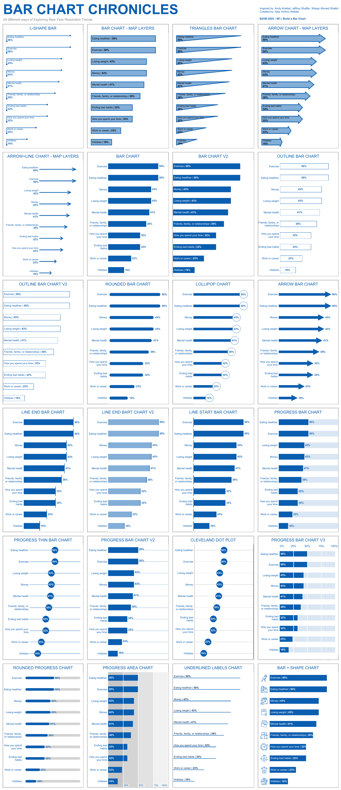

# The World of Bar Charts: New Year’s Resolutions Explored  

## Overview  
This project dives into the world of bar charts, showcasing the percentage of adults planning New Year’s resolutions in various categories such as health, finances, and personal habits. Using data from AP NORC, this visualization highlights trends and insights into goal-setting for the year 2025.  

## Project Highlights  
- 20+ creative versions of bar charts.  
- Focus on clarity, storytelling, and visual aesthetics.  
- Insights into resolution categories and their popularity among adults.  

## Tableau Dashboard  
Explore the interactive dashboard on Tableau Public: [**Link to Tableau Dashboard**](https://haproxy-traffic-splitter/views/BarChartChroniclesB2VB2025W1ExploringNewYearResolutionTrends/B2VB2025W1?:language=en-US&:sid=&:redirect=auth&:display_count=n&:origin=viz_share_link)  

## Snapshot  
Here’s a preview of one of the bar chart designs:  
  

## Files in Repository  
1. Dataset containing New Year’s resolutions data.  

2. Tableau workbook file for the project.  

3. Snapshot of the Tableau visualization.  
